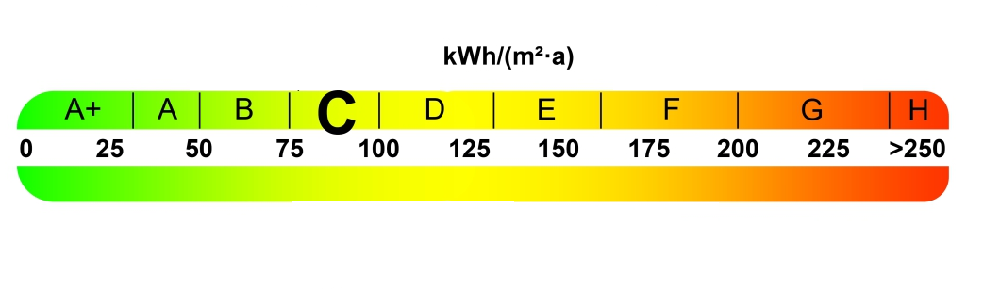
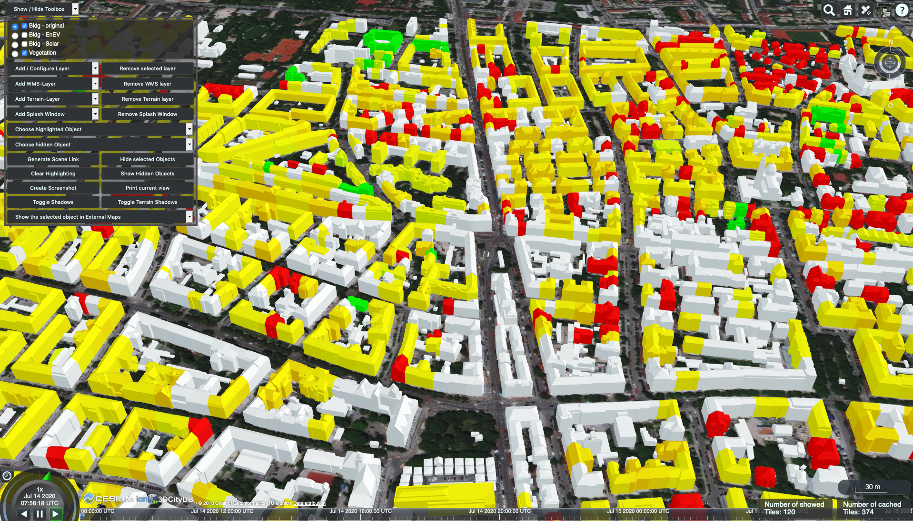
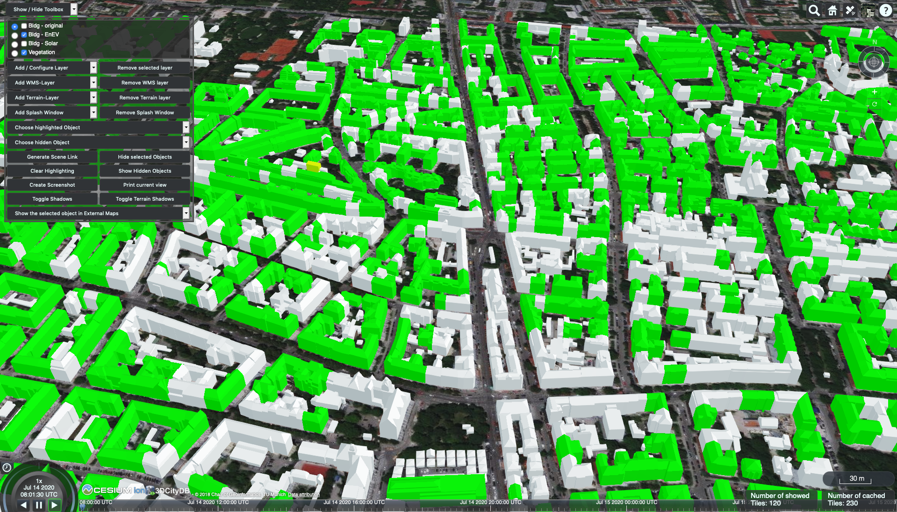

# Life Cycle Assessment of Technical Building Services of Large Residential Building Stocks Using Semantic 3D City Models

This repository contains the visualisation of the studies result, presented and published at the
[3D GeoInfo 2020 conference](https://www.ucl.ac.uk/3dgeoinfo/).
**!!! TODO !!! Add URL TO Article.**
The [Open Source 3D City Database Web-Map-Client](https://github.com/3dcitydb/3dcitydb-web-map/) is uses as visualization client.

> Click [HERE](http://3dcitydb.org/3dcitydb-web-map/1.8.2/3dwebclient/?title=3DCityDB-Web-Map-Client&shadows=false&terrainShadows=0&latitude=48.140635766050764&longitude=11.567695522667266&height=1412.2726628515468&heading=357.96057621677863&pitch=-38.96879082079747&roll=359.99121827623014&layer_0=url%3Dhttp%253A%252F%252Fwww.3dcitydb.org%252F3dcitydb%252Ffileadmin%252Fpublic%252F3dwebclientprojects%252FmunichLCA_TGA%252Fbldg_SPED_original%252Fbldg_collada_MasterJSON.json%26name%3DBldg%2520-%2520original%26layerDataType%3DCOLLADA%252FKML%252FglTF%26gltfVersion%3D2.0%26active%3Dtrue%26spreadsheetUrl%3D%26thematicDataSource%3DGoogleSheets%26tableType%3DHorizontal%26cityobjectsJsonUrl%3D%26minLodPixels%3D120%26maxLodPixels%3D1.7976931348623157e%252B308%26maxSizeOfCachedTiles%3D200%26maxCountOfVisibleTiles%3D200&layer_1=url%3Dhttp%253A%252F%252Fwww.3dcitydb.org%252F3dcitydb%252Ffileadmin%252Fpublic%252F3dwebclientprojects%252FmunichLCA_TGA%252Fbldg_SPED_EnEv%252Fbldg_collada_MasterJSON.json%26name%3DBldg%2520-%2520EnEV%26layerDataType%3DCOLLADA%252FKML%252FglTF%26gltfVersion%3D2.0%26active%3Dfalse%26spreadsheetUrl%3D%26thematicDataSource%3DGoogleSheets%26tableType%3DHorizontal%26cityobjectsJsonUrl%3D%26minLodPixels%3D120%26maxLodPixels%3D1.7976931348623157e%252B308%26maxSizeOfCachedTiles%3D200%26maxCountOfVisibleTiles%3D200&layer_2=url%3Dhttp%253A%252F%252Fwww.3dcitydb.org%252F3dcitydb%252Ffileadmin%252Fpublic%252F3dwebclientprojects%252FmunichCenter%252Fsolar-bldg-glTF%252Fdata_solar-bldg-glTF_collada_MasterJSON.json%26name%3DBldg%2520-%2520Solar%26layerDataType%3DCOLLADA%252FKML%252FglTF%26gltfVersion%3D2.0%26active%3Dfalse%26spreadsheetUrl%3Dhttp%253A%252F%252Ftumtest.duckdns.org%253A3000%252Fmunich_center%26thematicDataSource%3DPostgreSQL%26tableType%3DVertical%26cityobjectsJsonUrl%3D%26minLodPixels%3D120%26maxLodPixels%3D1.7976931348623157e%252B308%26maxSizeOfCachedTiles%3D200%26maxCountOfVisibleTiles%3D200&layer_3=url%3Dhttp%253A%252F%252Fwww.3dcitydb.org%252F3dcitydb%252Ffileadmin%252Fpublic%252F3dwebclientprojects%252FmunichCenter%252Fvegetation-glTF%252Fvege_collada_MasterJSON.json%26name%3DVegetation%26layerDataType%3DCOLLADA%252FKML%252FglTF%26gltfVersion%3D2.0%26active%3Dtrue%26spreadsheetUrl%3D%26thematicDataSource%3DGoogleSheets%26tableType%3DHorizontal%26cityobjectsJsonUrl%3D%26minLodPixels%3D120%26maxLodPixels%3D1.7976931348623157e%252B308%26maxSizeOfCachedTiles%3D200%26maxCountOfVisibleTiles%3D200&terrain=name%3DDGM1%26iconUrl%3Dhttp%253A%252F%252Fwww.3dcitydb.org%252F3dcitydb%252Ffileadmin%252Fpublic%252F3dwebclientprojects%252Fdgm.png%26tooltip%3D%26url%3Dhttp%253A%252F%252Fwww.3dcitydb.org%252F3dcitydb%252Ffileadmin%252Fpublic%252F3dwebclientprojects%252Fterrain_bay_geomassendaten&splashWindow=url%3Dsplash%252FSplashWindow.html%26showOnStart%3Dfalse) to view the online 3D web client demo Use [GoogleChrome](https://www.google.com/intl/de_de/chrome/)
> for best performance.

The case study shown in the client consists of 115,306 residential buildings in Munich, Germany.
All residential buildings are color-coded according to their specific primary energy demand
 [kWh/m²&middot;a] for the use stage. All non-residential buildings are colored grey.
 The coloring is done using the color scheme on the energy-related evaluation band of the
 German energy certificates, according to EnEV (see
 figure below).

The results for two scenarios can be selected in the toolbox on the top left. Here, for example,
the results for the scenario *Status Quo* and *Scenario 1* can be selected and shown
(see following figures).

## More information

The **3DCityDB-Web-Map-Client** is a web-based front-end of the 3DCityDB for high-performance 3D
visualization and interactive exploration of **arbitrarily large semantic 3D city models in CityGML**.
It utilizes the [Cesium Virtual Globe](http://cesiumjs.org/index.html) as its 3D geo-visualization engine
based on HTML5 and Web Graphics Library (WebGL) to provide hardware acceleration and cross-platform
functionalities like displaying 3D graphic contents on web browsers without the needs of additional
plugins.

[OGC CityGML](https://www.opengeospatial.org/standards/citygml) is an open data model and XML-based format
for the storage and exchange of semantic 3D city models. It is an application schema for the
[Geography Markup Language version 3.1.1 (GML3)](https://www.opengeospatial.org/standards/gml),
the extendible international standard for spatial data exchange issued by the Open Geospatial Consortium
(OGC) and the ISO TC211. The aim of the development of CityGML is to reach a common definition of the
basic entities, attributes, and relations of a 3D city model.

CityGML is an international OGC standard and can be used free of charge.

## Contact

For further information please contact:

Hannes Harter - Institute of Energy Efficient and Sustainbale Design and Building, Technical University of Munich [Contact Details](https://www.bgu.tum.de/enpb/team/hannes-harter/)

Bruno Willenborg - Chair of Geoinformatics, Technical University of Munich [Contact Details](https://www.lrg.tum.de/gis/unser-team/lehrstuhlangehoerige/bruno-willenborg/)
