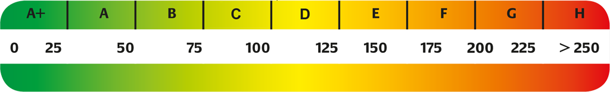

# Life Cycle Assessment of Technical Building Services of Large Residential Building Stocks Using Semantic 3D City Models

This repository contains the visualisation of the studies result, presented and published at the
[3D GeoInfo 2020 conference](https://www.ucl.ac.uk/3dgeoinfo/).
The [Open Source 3D City Database Web-Map-Client](https://github.com/3dcitydb/3dcitydb-web-map/) is uses as visualization client.

- [x] Click [HERE](https://3dcitydb.org/3dcitydb-web-map/1.9.0/3dwebclient/?t=3DCityDB-Webclient-LCA-TGA&s=false&ts=0&la=48.146859&lo=11.565392&h=731.369&hd=0.42&p=-43.57&r=360&l_0=u%3Dhttps%253A%252F%252Fwww.3dcitydb.org%252F3dcitydb%252Ffileadmin%252Fpublic%252F3dwebclientprojects%252FmunichLCA_TGA%252Fbldg_SPED_original%252Fbldg_collada_MasterJSON.json%26n%3DBldg%2520-%2520Status%2520quo%26ld%3DCOLLADA%252FKML%252FglTF%26lp%3Dfalse%26lc%3Dtrue%26gv%3D2.0%26a%3Dtrue%26tdu%3Dhttps%253A%252F%252Fbsvr.gis.lrg.tum.de%252Fpostgrest%252Flca_tga%26ds%3DPostgreSQL%26tt%3DHorizontal%26gc%3D%26il%3D120%26al%3D1.7976931348623157e%252B308%26ac%3D200%26av%3D200&l_1=u%3Dhttps%253A%252F%252Fwww.3dcitydb.org%252F3dcitydb%252Ffileadmin%252Fpublic%252F3dwebclientprojects%252FmunichLCA_TGA%252Fbldg_SPED_EnEv%252Fbldg_collada_MasterJSON.json%26n%3DBldg%2520-%2520Scenario%25201%26ld%3DCOLLADA%252FKML%252FglTF%26lp%3Dfalse%26lc%3Dtrue%26gv%3D2.0%26a%3Dfalse%26tdu%3Dhttps%253A%252F%252Fbsvr.gis.lrg.tum.de%252Fpostgrest%252Flca_tga%26ds%3DPostgreSQL%26tt%3DHorizontal%26gc%3D%26il%3D120%26al%3D1.7976931348623157e%252B308%26ac%3D200%26av%3D200&l_2=u%3Dhttps%253A%252F%252Fwww.3dcitydb.org%252F3dcitydb%252Ffileadmin%252Fpublic%252F3dwebclientprojects%252FmunichSolarFull%252Fvegetation_new%252Fmunich_vegetation_collada_MasterJSON.json%26n%3DVegetation%26ld%3DCOLLADA%252FKML%252FglTF%26lp%3Dfalse%26lc%3Dtrue%26gv%3D2.0%26a%3Dtrue%26tdu%3D%26ds%3DPostgreSQL%26tt%3DHorizontal%26gc%3D%26il%3D250%26al%3D1.7976931348623157e%252B308%26ac%3D100%26av%3D50&tr=name%3DDGM1%26iconUrl%3Dhttps%253A%252F%252Fwww.3dcitydb.org%252F3dcitydb%252Ffileadmin%252Fpublic%252F3dwebclientprojects%252Fdgm.png%26tooltip%3DDGM1%26url%3Dhttps%253A%252F%252Fwww.3dcitydb.org%252F3dcitydb%252Ffileadmin%252Fpublic%252F3dwebclientprojects%252Fterrain_bay_geomassendaten&sw=)
 to view the online 3D web client demo.
Use [GoogleChrome](https://www.google.com/intl/de_de/chrome/) for best performance.

- [x] The full paper is available on [MediaTUM](https://mediatum.ub.tum.de/1520859?show_id=1551986) and from [ISPRS Annals](https://mediatum.ub.tum.de/1520859?show_id=1551986). **ToDo: Add ISPRS URL when available.**

The case study shown in the client consists of 115,306 residential buildings in Munich, Germany.
All residential buildings are color-coded according to their specific primary energy demand
 [kWh/m²&middot;a] for the use stage. All non-residential buildings are colored grey.
 The coloring is done using the color scheme on the energy-related evaluation band of the
 German energy certificates, according to EnEV (see
 figure below).

 Unit: kWh/m²&middot;a 

## Scenarios

The results for two scenarios can be selected in the toolbox on the top left. Here, for example,
the results for the scenario *Status Quo* and *Scenario 1* can be selected and shown
(see following figures). Additionally, a short summary of the general assumptions regarding the calculations are provided. Please refere to the published paper for more detailed information.

### General Assumptions for Calculations

- The calculations are based on a single zone model.
- No building specific floor plan or zoning is used for the calculations.
- The energy demand calculation refers to the German Energy Saving Ordinance (EnEV) - DIN V 4108-6 and DIN
  V 4701-10. Specifically, the *heating period procedure* is chosen as an approach within DIN V 4108-6
  (Heating Period: 185 days).
- A Level-of-Detail 2 [CityGML](https://www.ogc.org/standards/citygml) building model is used as input data.
- Basements and underground car parks are excluded.

### Status Quo

- Layername: *Bldg - original*
- The energetic standard of the building, described by U-values, refer to its year of construction.

The results for the specific primary energy demand of szenario *Status Quo* show a high spread (in this specific screenshot), whereas most buildings are in the upper half of the energy denmand, based on the classification of the color scheme on the energy-related evaluation band.

### Scenario 1

- Layername: *Bldg - EnEv*
- The cubature of the buildings does not change, i.e. that there is no increase in height
- (urban redensification) and that no additional new buildings are added.
- All buildings are refurbished and not demolished and rebuilt.
- The refurbishment of wall, ground and roof surfaces is represented by the improvement of the U-values.
- When refurbishing the TBS components, it is assumed that all components are replaced completely.

The renovation changes the image significantly (in this specific screenshot) and almost all
buildings are in the "green" area and therefore have a very low specific primary energy requirement.

## More information

The **3DCityDB-Web-Map-Client** is a web-based front-end of the 3DCityDB for high-performance 3D
visualization and interactive exploration of **arbitrarily large semantic 3D city models in CityGML**.
It utilizes the [Cesium Virtual Globe](http://cesiumjs.org/index.html) as its 3D geo-visualization engine
based on HTML5 and Web Graphics Library (WebGL) to provide hardware acceleration and cross-platform
functionalities like displaying 3D graphic contents on web browsers without the needs of additional
plugins.

[CityGML](https://www.opengeospatial.org/standards/citygml) is an open data model and XML-based format
for the storage and exchange of semantic 3D city models. It is an application schema for the
[Geography Markup Language version 3.1.1 (GML3)](https://www.opengeospatial.org/standards/gml),
the extendible international standard for spatial data exchange issued by the Open Geospatial Consortium
(OGC) and the ISO TC211. The aim of the development of CityGML is to reach a common definition of the
basic entities, attributes, and relations of 3D city and landscape models. CityGML is an international standard of the OGC and can be used free of charge.

## Contact

For further information please contact:

- [Hannes Harter](https://www.bgu.tum.de/enpb/team/hannes-harter/) - Institute of Energy Efficient and Sustainbale Design and Building, Technical University of Munich
- [Bruno Willenborg](https://www.lrg.tum.de/gis/unser-team/lehrstuhlangehoerige/bruno-willenborg/) - Chair of Geoinformatics, Technical University of Munich

## Acknowledgements

We thank the [Bavarian State Office for Digitization, Broadband and Surveying](https://www.ldbv.bayern.de/) (Project: Geomassendaten) for providing the CityGML data as well as the [Planning Department of the Bavarian State Capital Munich](https://www.muenchen.de/rathaus/Stadtverwaltung/Referat-fuer-Stadtplanung-und-Bauordnung.html) for providing all other building-specific parameters (e. g. year of construction).
